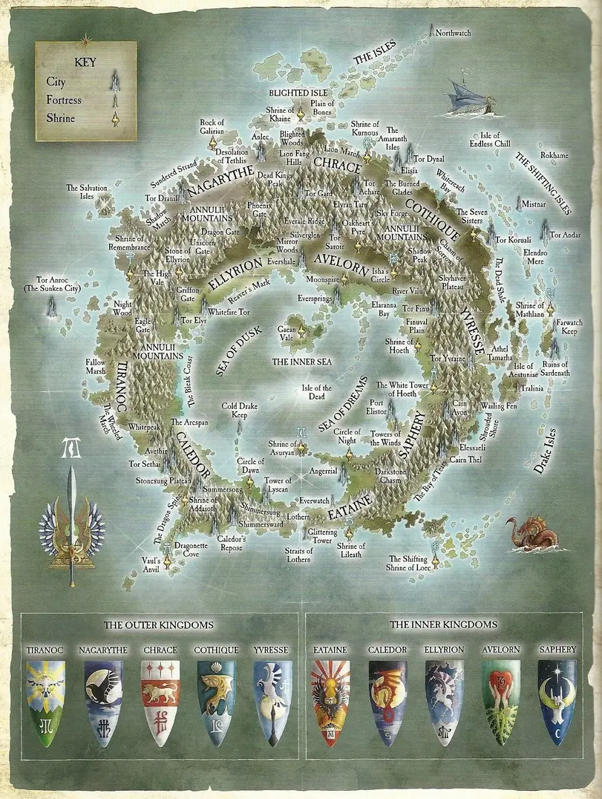

# 地区
奥苏安

## 泰伦洛克
位于最西端

以战车出名

## 纳迦瑞斯
黑暗而荒凉的土地

以影行者出名

影王的故乡

## 查瑞斯
森林居多

以白狮出名

## 柯斯奎
沿海

以航海技术出名

## 伊瑞斯
多雾

以狮鹫出名

## 伊泰恩
洛瑟恩，腹地

以海卫和凤凰守卫出名

## 卡勒多
群山居多，多要塞。瓦尔铁砧

以龙出名

## 艾里昂
广阔的平原为主

以战马和骑射出名

## 阿瓦隆
阿瓦隆森林，永恒女王

## 萨弗瑞
荷斯白塔

以魔法出名