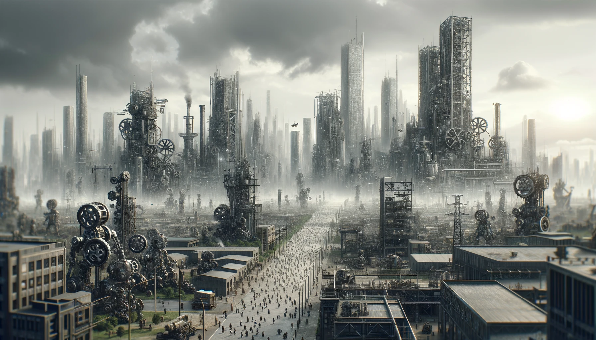

# 信息之都 图书馆

面积 1500平方公里，人口 900万

主修科技：人工智能，机器人技术，VR及AR技术，网络信息和安全，脑机接口

作为世界的信息中心而存在。作为网络的中心，任何信息都要流经这里，因此这里也是最大的信息处理和贩卖中心

这座城市的每个大楼都布满了全息投影的显示屏，街道上随处可见服务型机器人

在成为信息之都的居民前，要先植入代表身份的芯片，因此这里也被称为毫无隐私的地狱。即使是这样，无数人想要涌入信息之都，但在严格的限制政策下，只有极少人能够如愿

# 机械之都 世界工厂

面积：5000平方公里，人口 5000万

主修科技：化学工程，机械工程，电子机械，机器人技术，土木工程

世界工厂，主要化工品和机械制品的产出地

这里聚集了大量的工人，在这末日的世界，能够存活便已是万幸，除了少数的精英工程师，大多数的工人都是可能随时在工厂和工地上死去的耗材

这座城市和信息之都以及科学之都的往来非常频繁

城市的结构非常精妙，使其能够快速移动内部的建筑。大街上也随处可见各种机器人

机械之都有着世界上最大的常备军队（之一）

# ref

1. **东京（日本）** - 东京是世界上人口最多的城市之一。大东京地区（包括周边的卫星城市）的人口超过3700万。东京都市区本身的面积大约为2200平方公里。

2. **孟买（印度）** - 孟买是印度最大的城市，也是世界上人口最多的城市之一。它的人口大约是2000万左右。孟买的面积约为603平方公里。

3. **上海（中国）** - 上海是中国最大的城市，人口超过2400万。它的面积约为6340平方公里。

4. **纽约市（美国）** - 纽约市是美国人口最多的城市，大纽约都会区的人口超过2000万。纽约市本身的面积约为789平方公里。

5. **圣保罗（巴西）** - 圣保罗是巴西最大的城市，人口大约1200万，是南美洲人口最多的城市之一。圣保罗市的面积约为1521平方公里。

6. **伦敦（英国）** - 伦敦是英国的首都和最大城市，人口约为900万。伦敦市的面积约为1572平方公里。