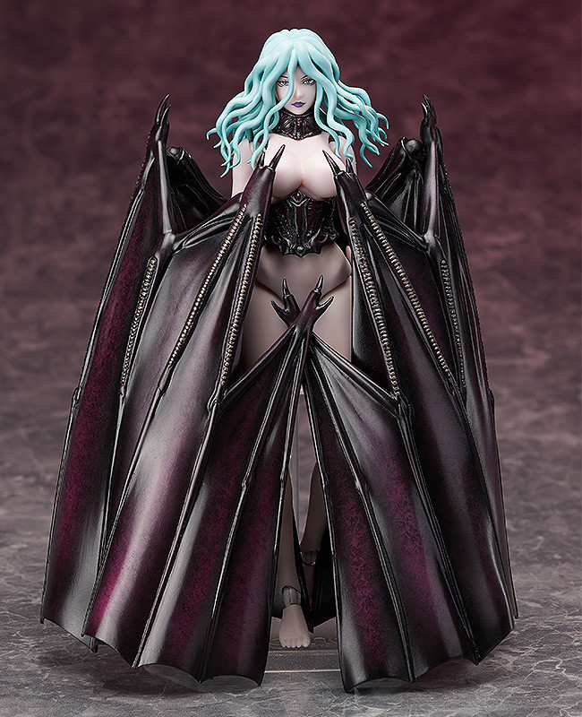

# 神之手

神之手是被神选中，行走于世间的神的代言人

神的行为不可推测，神之手各自有着各自的特点，但他们所有的行为，都体现了神的意志

要想成为神之手，有三个条件：
1. 拥有贝黑莱特，这是成为被神选中的候选人的证明
2. 拥有自己的信众，这些信众将成为“蚀”的祭品
3. 经历难以想象的绝望，在绝望之中贝黑莱特将流下血泪

# 光之鹰 暗之翼 FEMTO

第五位神之手，过去的鹰之团团长格里菲斯，如今的光之鹰FEMTO

## 历史
格里菲斯的梦想是建立自己的王国，身为鹰之团的团长，他在米特兰王国和尤达帝国的百年战争中，全歼了对面最强的紫犀骑士团，并仅靠一个团夺得了军事重地 -- 多尔杜里城堡。使得尤达帝国最终战败

米特兰国王亲自钦点他为伯爵，并许诺将公主许配给他，他成为国王的梦想近在咫尺

在成为伯爵后，他派格斯去刺杀反对自己的王国大将军，格斯失误只能将大将军的三个孩子全部杀死，之后格斯提出退出鹰之团

格里菲斯和格斯决斗，格斯获胜，格里菲斯只能让格斯离开，但自己却失去了理智，当晚便找公主偷情发泄情绪。结果第二天被国王发现，关进地牢（国王也对女儿有着畸形的爱）。而鹰之团也被国王设计陷害，被迫流亡

一年后格斯回归得知事情后立即和鹰之团回王城救格里菲斯，但这一年格里菲斯已被折磨得不成人样

一天夜里，他驾车逃跑，倒在湖水中央，绝望之中，贝黑莱特流下了血泪，“蚀”开始了，这次的祭品是所有的鹰之团团员

## 故事
FEMTO先是借助使徒EGG的愿望以另一个身份重回人世，他重新潜入米特兰王国内部，成为了首辅大臣的亲信，他设计让米特兰王国战胜了恐帝。当恐帝咆哮死去的时候，神界和人间的界限被打破，使徒蜂拥而入

他派遣大量使徒攻击米特兰王国的城镇，米特兰王国的首都都差点被攻陷，危在旦夕，这是他重新回到王都，杀死自己派遣的使徒，获得了人民的信赖。公主认出了格里菲斯，如今的FEMTO，内应外合推翻了国王，FEMTO重新改建米特兰王国为光之国

# 胎海娼妓 SLAN

第四位神之手，代表着色孽和欲望

## 历史
SLAN原本是一位修女，她本出身米特兰王国的贵族家庭，但甘愿称为教会的修女，去收留和养育孤儿

她无意中在教堂的地下室发现了贝黑莱特

负216年，尤达帝国对SLAN所在的城镇发动了入侵，他们烧杀摞掠，企图强奸SLAN

在绝望之中，贝黑莱特流下了血泪，“蚀”开始了

攻入城镇的士兵瞬间被使徒杀死，而SLAN收容的所有孤儿都被打上了祭品的烙印

# Ubik

第三位神之手，欺诈与幻象之神

## 历史
Ubik本是一名剧作家，他出生在一个商人家庭，他从小孤僻，只对各种书籍感兴趣，因为不擅长与人交流，他开始编写自己的舞台剧

他写的舞台剧一开始在当地很火，但并不出名。直到有一天，他跟随父母的商队出行，亲眼目睹了使徒袭击商队，当时一位雇佣兵救下了他们，这次经历让他看到了想象之外的世界，也激发了他的灵感，从此他创作的舞台剧远近闻名，无数人慕名前来欣赏。从被杀死的使徒身上，他也捡到了贝黑莱特，之后他每次看到贝黑莱特，灵感都会迸发

但他仍然不善于言语，因此得罪了教廷成员，教廷成员向教皇上报，谋划陷害Ubik。在一次国宴级别的表演时，主演突然停止表演，开始指责和控诉Ubik，说他的作品离经叛道，侮辱了上帝，国王受到如此大的侮辱，当即下令挖掉Ubik的双眼，烧死Ubik，在烈焰中，Ubik口袋里的贝黑莱特流下了血泪

## 能力
Ubik能够制造幻境，唤醒人们过去的回忆。他擅长操控人们的情绪，引导人们走上既定的道路

# 瘟神 Conrad

第二位神之手，神秘与恐怖的瘟疫死神

## 历史
Conrad生活在霸王加尔塞利克的帝国崩溃的200年后，这200年战争不断，瘟疫横行

Conrad的亲人都在疾病中去死，Conrad在绝望之际，捡到了贝黑莱特（但当时由于没有祭品，贝黑莱特没有启动）

就在这时，Conrad遇到了自己的老师，这位老师知道贝黑莱特，看着眼前的年轻人，他本想痛下杀手，但最后他选择另一种方式去拯救这位年轻人

他教给了Conrad医术，十几年后，Conrad成为了远近闻名的神医，若干次爆发的巨大瘟疫都被Conrad医治，他也因此获得了一大批追随者

他过去的老师年事已高，但他很欣慰自己有如此出色的徒弟

但是，Conrad无偿救治病人的举动导致了很多人的不满，他们是从瘟疫中牟利的医师，他们明明自己有治病的良方，但就是想让瘟疫持续得更久，来赚取更多的钱

他们设计在一次贵族的晚宴上诬陷了Conrad，贵族当即将Conrad打入大牢折磨，Conrad的追随者们舍命将他救出，但当Conrad回到故地，自己的老师已被处死，当街示众

Conrad崩溃了，他不知道为什么像治病疗伤这样的事都会遭到嫉妒，就在这时，贝黑莱特流下了血泪

## 故事
1. 

在FEMTO重获肉体的前夕，米特兰王国边缘的一个小城发生了巨大的瘟疫，民众全部赶往断罪塔避难

瘟疫之后，整座城镇充满了黑色的老鼠，而这次瘟疫的罪魁祸首就是Conrad

2. 

在FEMTO和公主重新见面后，Conrad在一次晚宴化身宫廷使者为国王献上美酒，当晚国王便重病在床，让FEMTO和公主有时间谋划政变

# 智者 Void

第一位神之手，曾经的智者，与霸王携手统一了帝国，但也是帝国的毁灭者

## 传说
Void的大脑裸露在外，眼睛被缝上，暗示其曾受过虐待

传说：
Void与霸王加尔塞利克一起统一了帝国，霸王四处征战而智者传播信仰

可能是两人的治国理念不同，可能是智者的信仰传播过广，可能是霸王开始骄傲自满，智者被霸王偷偷囚禁了。究竟发生了什么，想必只有如今的骷髅骑士和Void两人知晓

总之，Void在监狱中受到非人的虐待，在绝望之中，贝黑莱特流下了血泪，整个王都中所有人都是智者的信众，他们都被打上了祭品的记号

## 能力
Void拥有看透因果的能力，能看透近期的历史，预知短期的未来