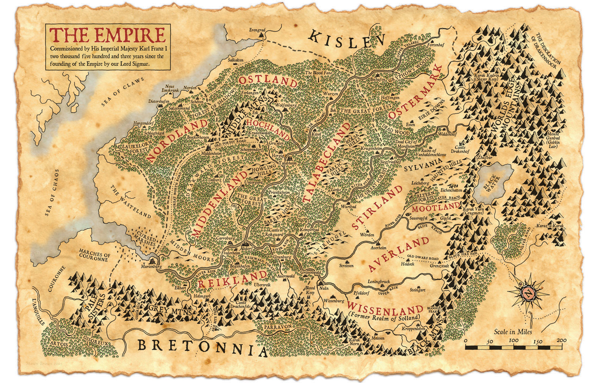
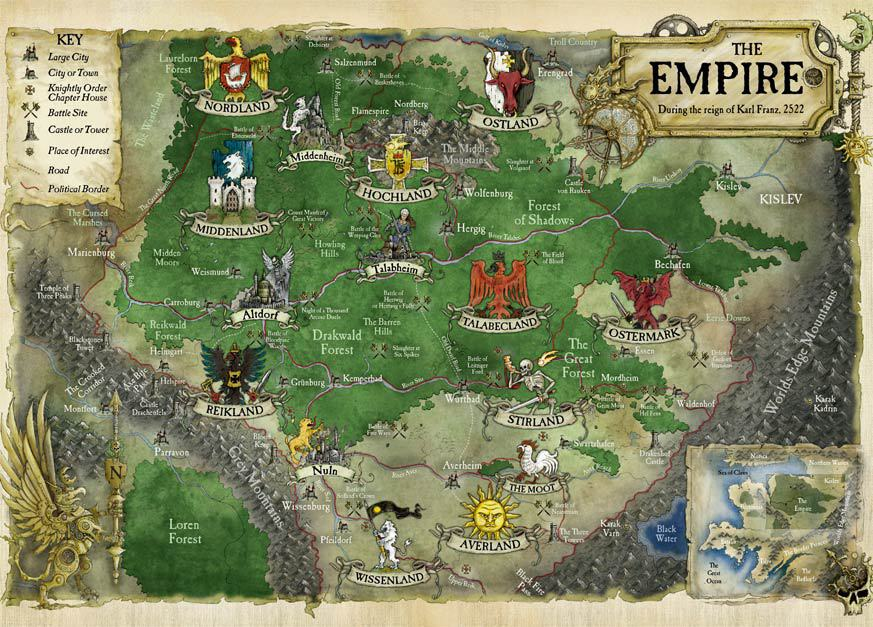

# 人类大帝国
以西格玛为信仰建立的大帝国

# 领土

- 瑞克领：心脏和魔法学院
- 希尔瓦尼亚：吸血鬼
- 塔拉贝克领：辽阔
- 米登领：高山城堡和黑暗森林
- 奥斯特马克领：长牙之路
- 威森领：努恩工厂和工程学院
- 斯提尔领：贫穷，斯提尔河
- 穆特领：[半身人](种族/半身人.md)
- 艾维领：善于骑马，黑火隘口
- 霍克领：领土小，喜欢玩枪
- 奥斯特领：抗混一线，公牛为象征
- 诺德领：海军，劳恩罗伦森林
- 韦斯特领：贸易发达，玛丽恩堡，常闹独立

# 组织架构
- 教会
- 佣兵团
- 骑士团
- 商会
- [工程师行会](./工程师行会/.md)
- 兄弟会
- 魔法师联盟