# Alpha-1 红右手
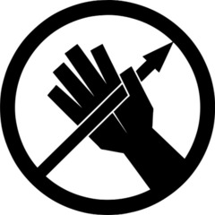

直属于O5议会的机动特遣队，由最忠诚和最优秀的职员组成，负责处理最严重的情况

# Alpha-2 天网
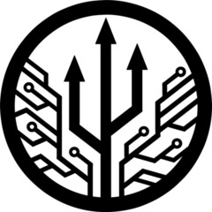

任务是处理网络和信息方面的异常，以及研发维护基金会内部的网络系统，和防止黑客攻击及内部信息泄露

# Alpha-4 小马快递
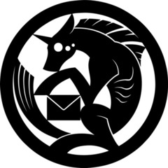

机动性非常强的MTF，负责处理大范围社会性异常，卧底在社会各处

# Alpha-5 观鸟者
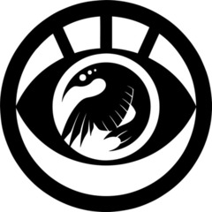

间谍单位，负责监视，调查其他相关组织和秘密回收scp

# Alpha-6 猎人轰炸机

负责追踪，捕获和处理收容大型异常

# Alpha-7 疯帽匠
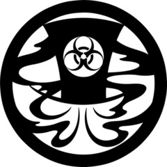

主要负责处理生物，化学，放射性的异常，包括应对大规模异常疾病

# Alpha-9 潘多拉

负责训练威胁较低的scp和研发scp武器来协助基金会，来源于Omega-7计划

# Alpha-10 非礼勿视
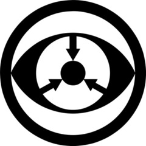

负责研究，管理和收容有认知危害的的异常

# Alpha-11 九尾狐
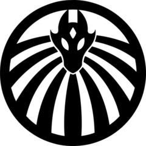

各个设施的警卫直属于九尾狐，也有机动性的特遣队，负责处理收容失效和各站点可能发生的入侵事情

# Alpha-15 梦

使用基金会自主研发的梦境技术Oneiroi，负责处理意识和梦境中的认知异常或其他异常

# Alpha-16 轮回
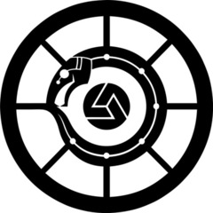

基金会利用研发的仿生人技术成立的MTF

# Alpha-19 三角

负责研究和处理异常拓扑，几何等空间异常

# Alpha-13 阿西莫夫仲裁者
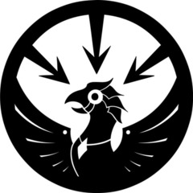

负责追查，研究，捕获机械类相关的异常

# Alpha-777 纯黑之矛

专精于奇术仪式的解析和应对，并与奇术交战

# Beta-1 联邦探员
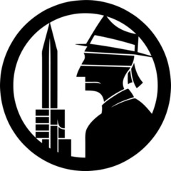

负责处理美国北美地区的异常

# Beta-2 城市滑头
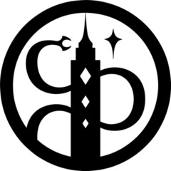

负责处理北美加拿大地区的异常

# Beta-3 美食家

负责处理欧洲城市区域的异常

# Beta-4 乡里愚人

负责处理欧洲农村，荒野和郊区地区的异常

# Beta-5 漂流者

驻扎于澳大利亚的分遣队，主要处理当地频发的动物异常

# Beta-6 红鲱鱼

负责处理大西洋海面和深处的异常

# Beta-7 深渊喂食者
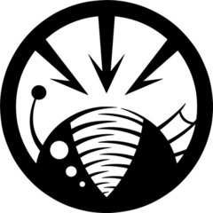

负责处理太平洋海面和深处的异常

# Beta-8 噬火者

负责处理非洲地区的异常

# Beta-9 投资人
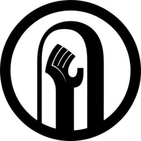

负责处理东南亚地区的异常

# Beta-10 鼹鼠
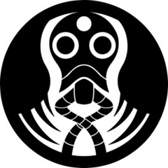

负责处理南美地区的异常

# Beta-11 重锤
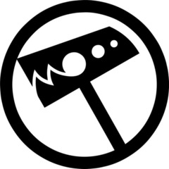

负责处理中东地区的异常

# Beta-12 兔
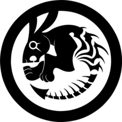

负责处理东亚地区（中国，朝鲜，韩国）的异常

# Beta-13 武士犬

负责处理日本地区的异常

# Beta-14 争执

负责处理俄罗斯区域的异常

# Beta-19 塞西利亚人
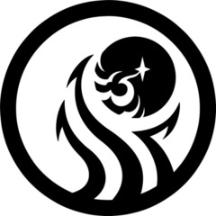

负责处理外星球（主要为月球）的异常