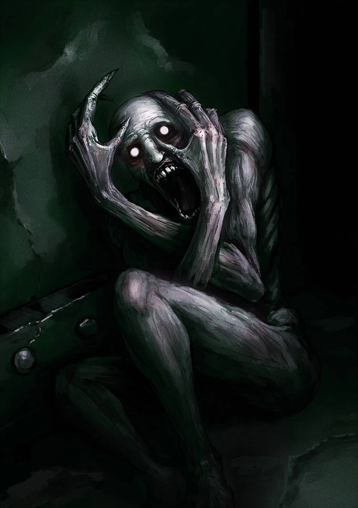

# 096 羞涩的人
危险等级：Keter

始终处于悲伤之中

在没有被攻击或者没有被看见面部的情况下十分温和，只会一个人蹲在墙角哭泣

但它一旦被攻击或被看到面部（无论是现场看到还是在照片中看到），它就会在短暂时间后暴怒，并一直追逐那个攻击或看到它面部的人

它的速度极快，并且力量极强，能够破坏任何材质的墙壁

它会尝试追逐并杀死目标，但它不能飞行或遁地。当目标处于高空中时，它会尝试破坏支撑物让目标掉落到地面，目标处于地底，它则会挖掘泥土和岩石尝试到达目标的位置。这个过程会持续十分钟，如果十分钟它仍未能杀死目标或目标处于外太空这种无法抵达的位置，它会重新回到温和状态

# 应对措施
Alpha-11九尾狐手下有一支特殊的机动队Epsilon-096“盲人”负责监视和重收容scp096

他们使用基金会利用scp079研发的096频闭装置，这个装置能自动识别和频闭096的面部，因为利用scp079研发，反应速度仅有0.0005s，小于人类大脑认知速度，因此不会导致096暴怒

# 画廊（不要命啦！）

