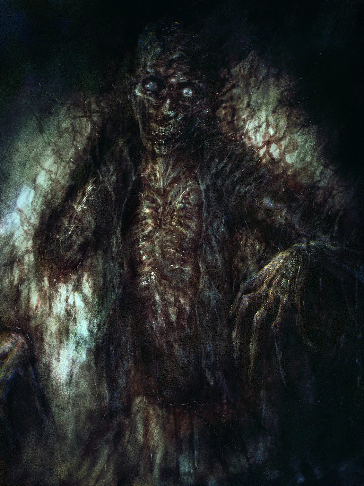
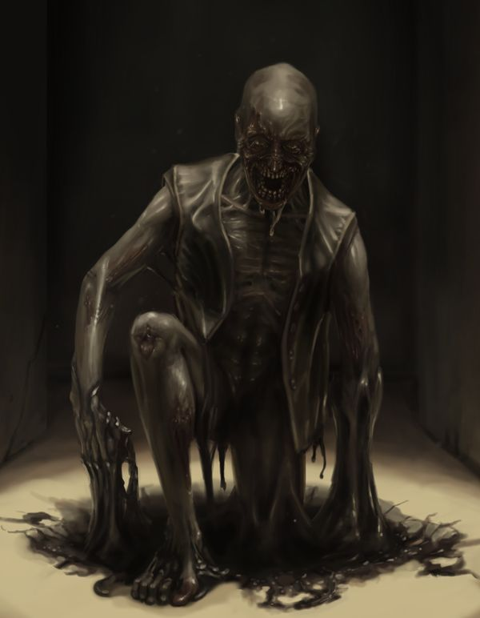

# 106 恐怖老人
恐怖老人能够自由在一个叫做“黑色空间”的地方穿梭

它能够潜入地下或者墙中来进入黑色空间，并且从任意一面墙，地板或天花板离开黑色空间

它喜欢将猎物捕捉到黑色空间

# 黑色空间
黑色空间内所有光源不起作用，但四处都有微弱的光芒

黑色空间的布局就像一座迷宫，scp106似乎能自由穿过其中的墙

当人类在黑色空间所处的时间过久，就会出现可怕的幻觉，导致自残或者伤害同伴的行为

黑色空间内有出口，但较为罕见，侥幸逃离的幸存者会随机从一面墙或地板中出现

# 收容措施
由于scp106能够自由穿过墙壁，所以不存在能够永久将其收容的措施

但基金会有三重保险应对其收容失效：
1. scp106的收容间的墙壁被设计成了一种不断变换的三角形柱状的拓扑结构，实验证明在这种结构中scp106也会在黑色空间中迷路
2. Alpha-11九尾狐和Alpha-19三角有一支特殊机动队Epsilon-106“无畏探索者”专门负责应对scp106的收容失效
3. Alpha-777纯黑之矛研究出一种奇术，只需要在收容间中心设置奇术阵并牺牲一个人作为供品，就能够将scp106重新传送到收容间中心

# 画廊

