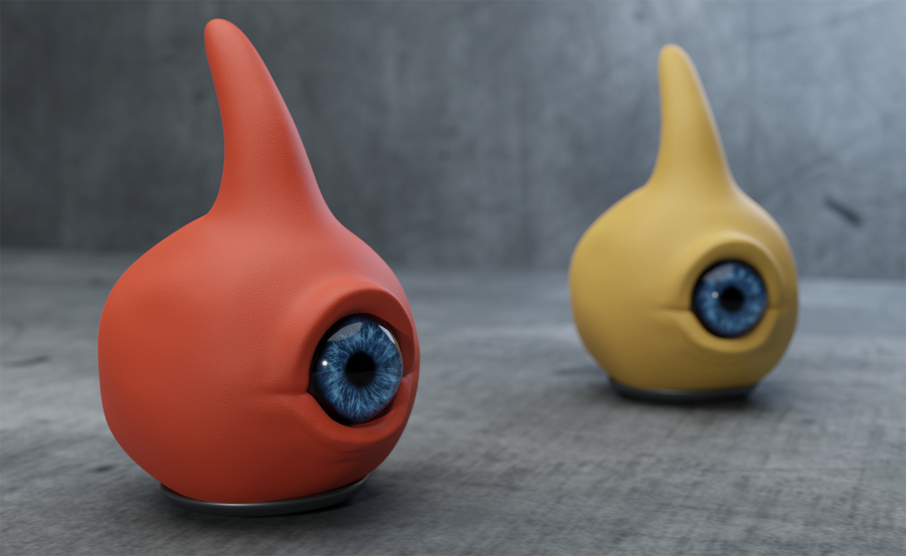

# 131 眼豆

危险等级：Safe

131是一个种类的生物

其没有任何异常特性，甚至能给研究人员带来娱乐，因此允许其在设施内自由行动

其生理特征使其能够高速移动，但并没有很强的制停能力，跑起来后需要滑行十几米才能停下

其对这个世界表现出强烈的好奇心

其对危险有较强的感知能力，在危险靠近时会发出呀呀的叫声

实验证明scp131不需要眨眼，能有效针对scp173

# 利用价值
scp131被安置在site-02附近的site-06，因为其具有克制scp173的能力和能够提前感知危险，所以当site-02发生收容失效时，MTF会先前往site-06带上scp131和其他有用的Safe级scp后前往site-02镇压