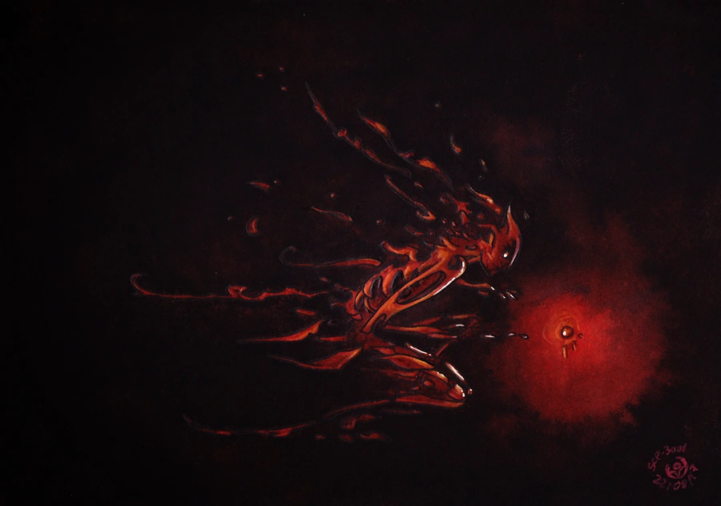

# 3001 红现实

3001，又称红现实，这是绿色现实--[亚空间](../../../Z/亚空间/.md)和X巢之间的一个夹层

红现实中是一片虚无

因为其一成不变的特性，其休谟指数\(即熵值\)恒定为0

[斯克兰顿现实稳定锚](../../装置和武器/斯克兰顿现实稳定锚/.md)的研发便依赖于红现实。它将一定范围内的现实异常现象放逐到红现实之中，用红现实中恒定为0的休谟指数去冲淡高休谟指数的异常

因为一次意外，斯克兰顿博士和若干研究员现一直被困于scp3001中，这次意外也导致O5议会制定了限制使用斯克兰顿现实稳定锚的规定

Clef博士是那次意外中的唯一幸存者，也是唯一能够了解到被困scp3001中研究员境况的人。Clef博士的身体和scp3001产生了连接，导致其免受任何现实扭曲的影响。他汇报说斯克兰顿博士等人在scp3001中，他们的身体和精神永远不会腐烂，但他们只能漫无目的地在scp3001中游荡