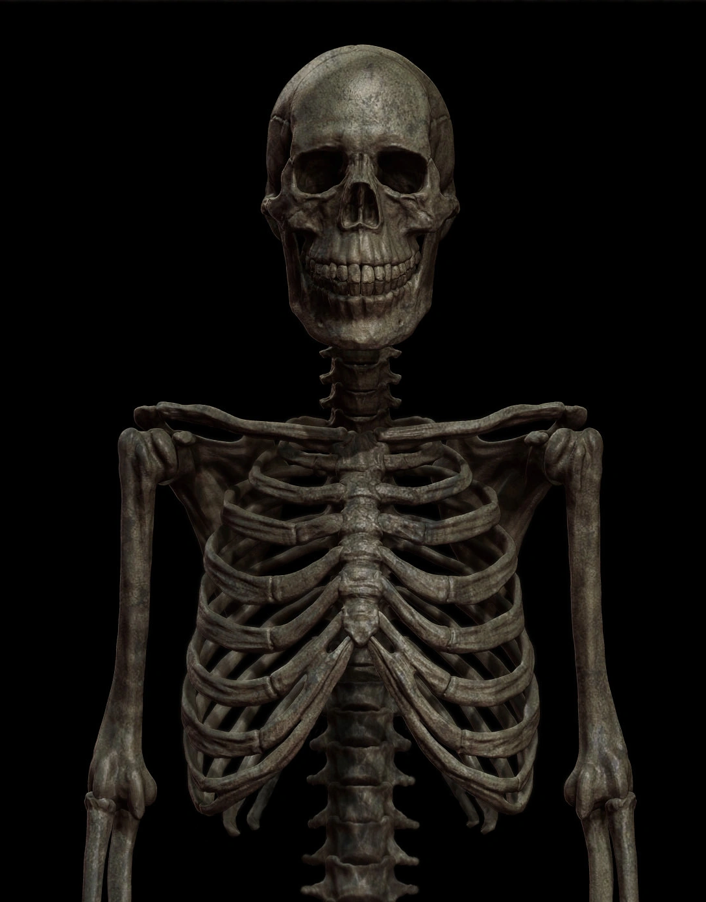

# 3114 骷髅

3114是一具人体骷髅，在杀死猎物后它能够将受害者的皮囊拔下，穿在自己的身上

# 应对措施
3114自身的战斗力并不强，因此被划分为Euclid

应对3114要注意的是自己身边的人和遇到的其他人

Alpha-11九尾狐特殊机动队Epsilon-3114“透视眼”的成员骨架均被特殊物质标记，且持有特殊装置识别该标记，发现非标记成员即可识别3114

并且基金会内部有一套密语用来验证对方是否仍是自己，见[黑月是否嚎叫](../../术语/暗号/.md)