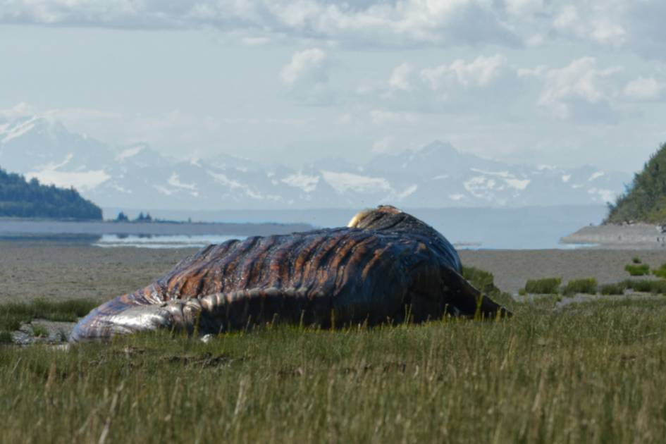

# 682 不灭蜥蜴
危险等级：Keter

scp682是一只大型蜥蜴型生物

scp682对一切实体都有极大的敌意，会攻击视野范围内的一切实物，且其攻击力极强，甚至能冲破墙壁

scp682最强大的特点在于其极强的再生能力，即使身体被破坏98%，仅通过尾部四天后其也能完全再生

# 收容措施
scp682的收容单元被灌满硫酸，使其被不断腐蚀又不断复原，使其失去突破墙壁的能力

Alpha-6猎人轰炸机和Alpha-11九尾狐联合特殊机动队Epsilon-682“捕蜥人”专门负责scp682的重收容，其使用能快速造成大量伤害的便捷重型武器