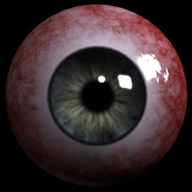

# 718 眼球

危险等级：Euclid

一个悬浮在空中的眼球，移动速度并不快，血量较高

与其对视者将感受到精神上的不适，这种不适感将不断增强，最终导致精神崩溃

这种不适感的增强速度随距离减少极速加快，极近距离下对视会直接导致崩溃

# 实验
- 距离25m：对视3min后精神失常
- 距离10m：对视1min30s后精神失常
- 距离5m：对视30s后精神失常
- 距离2m：对视10s后精神失常
- 距离1m：对视2s后精神失常
