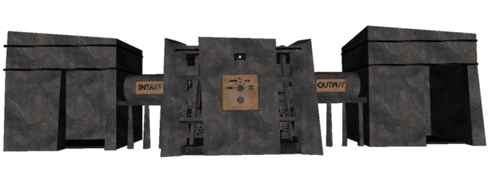

# 914 合成机器
危险等级：Safe

914是一台大型的机器

共有五个挡位：超粗，粗，1比1，精和超精

使用粗或超粗会使物品质量降低，而精和超精能提升物品质量，但使用超精加工有概率使物品损坏

使用1比1时物品大概率不变，仅有细节变化，也有可能变为质量相同的等价物品

# 合成表
[链接](https://wiki.biligame.com/scpsl/914/%E5%90%88%E6%88%90%E8%A1%A8)