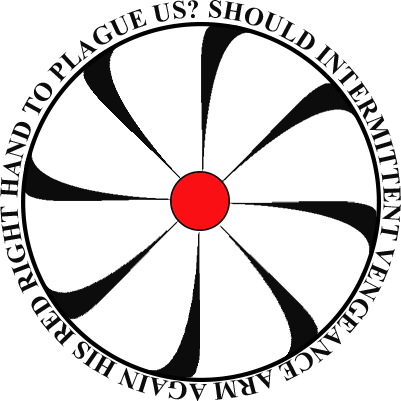
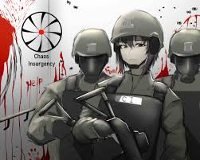

# Chaos Insurgency 混沌分裂者
“人类需要的，是进步。”

与基金会收容和处决scp，防止其威胁人类的宗旨不同，混沌分裂者认为scp都是可以被人类利用的工具。

他们大肆使用scp作为自己的武器，无论其危险与否。比如混沌分裂者的霰弹枪子弹就使用异常技术制造，能够穿过碳化硅。

# 起源
CI的起源不得而知，广为流传的有两则：
1. 认为是一位和其他人意见不合的O5离开基金会，建立了混沌分裂者
2. 认为是某位5级现实扭曲者建立

# 画廊
