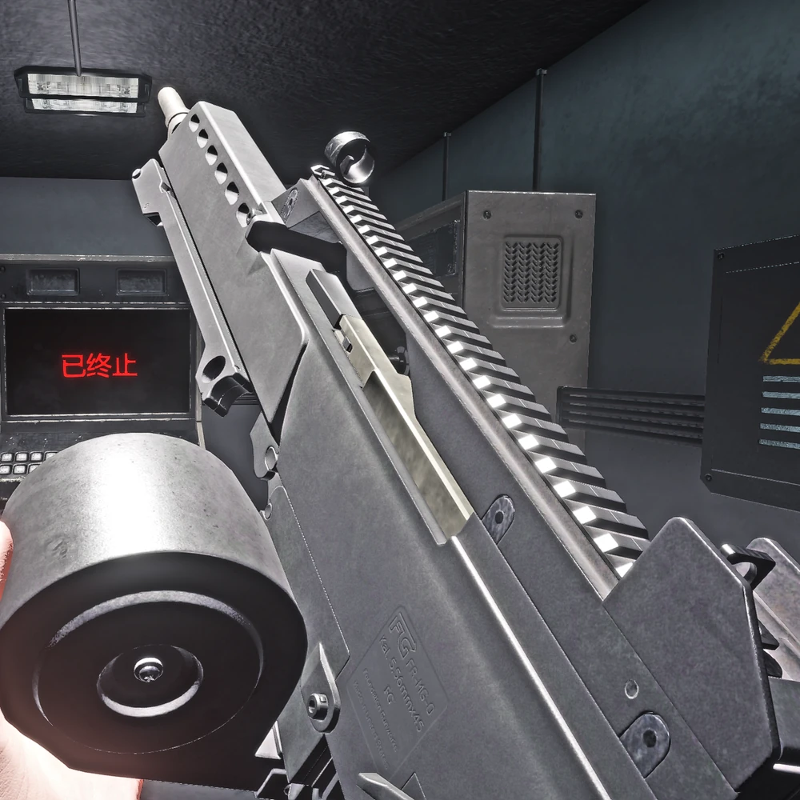
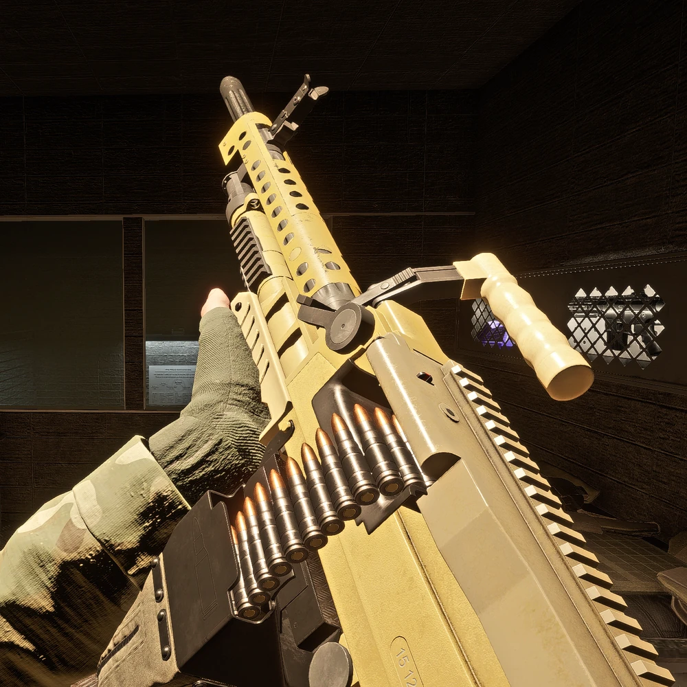

# com-15

手枪，廉价

# com-18(usp)

高容量、轻量化、尺寸小，可以在紧急情况下快速拔出

曾经作为基金会的标准配发手枪，现被FSP-9取代

# FSP-9(mp7)

冲锋枪，设施警卫的标配武器

# Crossvec

大量配发九尾狐列兵的9毫米冲锋枪, 具有高射速，采用了平衡支援向量(Counter Support Vector - CSV)系统, 一种能降低后座力的系统

# MTF-E11-SR

九尾狐中士职衔的制式步枪。轻量化、高度模块化。性能均衡

# FR-MG-0

5.56轻机枪, 低后座力, 高火力, 高射速, 高弹容量, 高精度。九尾狐指挥官标配武器

# AK突击步枪

一把模组化改装的AK，大量分配给前线人员，大威力、高后坐力

# 霰弹枪

一把12号口径、双管、大容量的霰弹枪，特质的强力弹药, 据说材料来自于混沌分裂者过去夺得的某个异常，让弹丸获得了穿过碳化硅的能力。混沌掠夺者标配

# .44左轮

混沌掠夺者标配副手武器，全距离通用的副手武器, 可靠、便于维护、大威力和便宜, 拥有1枪爆头的强大威力。

转起枪来很帅，也可以快速拉动击锤

# Logicer 轻机枪

少量配发的威力强大的7.62机枪, 穿透力强，弹容量大，特别沉重