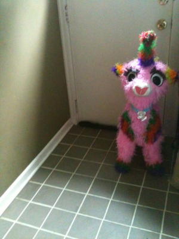

# 956 彩虹小马

危险等级：Safe

scp956在平时不会移动

当实体进入scp956 5米范围以内时，有概率使scp956进入激活状态，该实体此时称为scp956-2

激活状态下scp956-2会丧失一切行动能力和发声能力，但其眼部活动证明其仍有意识

激活状态下scp956会缓慢向scp956-2移动，并以极大力量冲击scp956-2，并从冲击部位爆出大量糖果（这些糖果与scp330中的相同）

在激活状态下使scp956-2脱离scp956的视野或者移动到5米外可以取消激活状态

# 应对措施
MTF和相关基金会成员已被告知不要靠近scp956，但scp们却并不知道

在一次收容失效中，最麻烦难于收容的scp372因为激活了scp956被造成大量伤害，很快被MTF重收容