# 深渊 Abyss
深度超过2万米

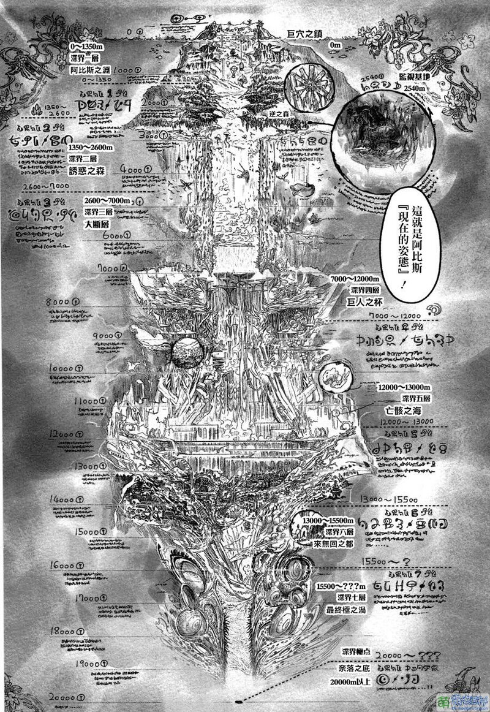

# 巨穴之镇 奥斯小镇

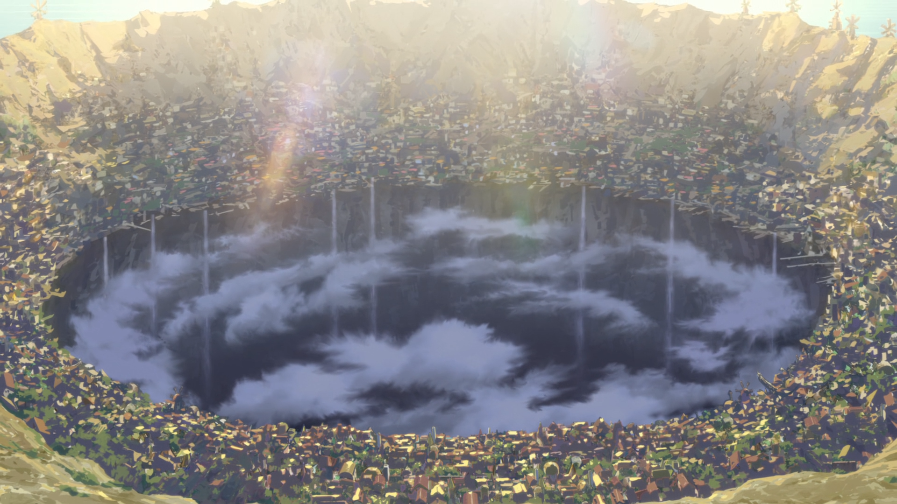

大线桥：探窟家凯旋时使用的线桥，也是热气球的接收地

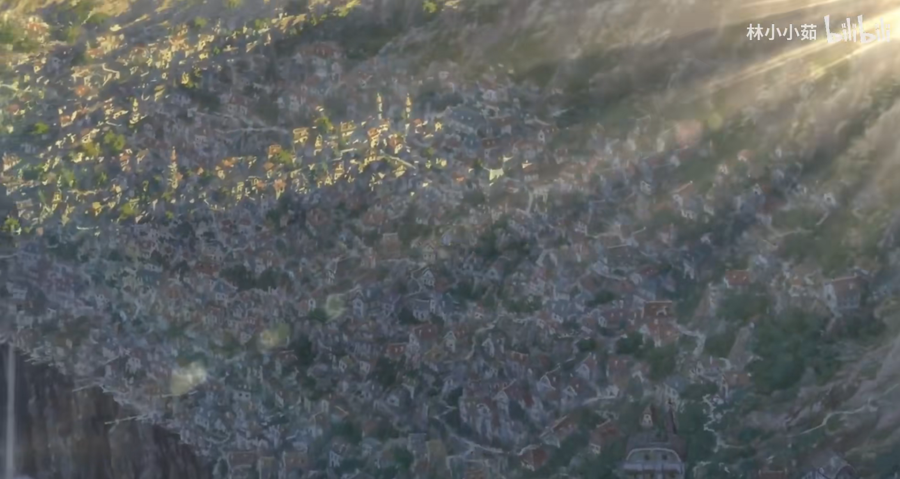

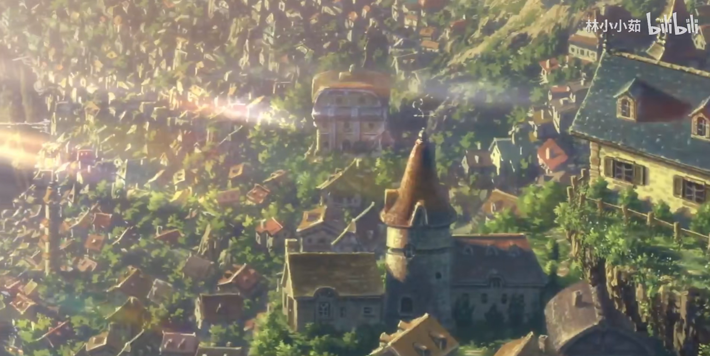

崖壁街：贫民窟

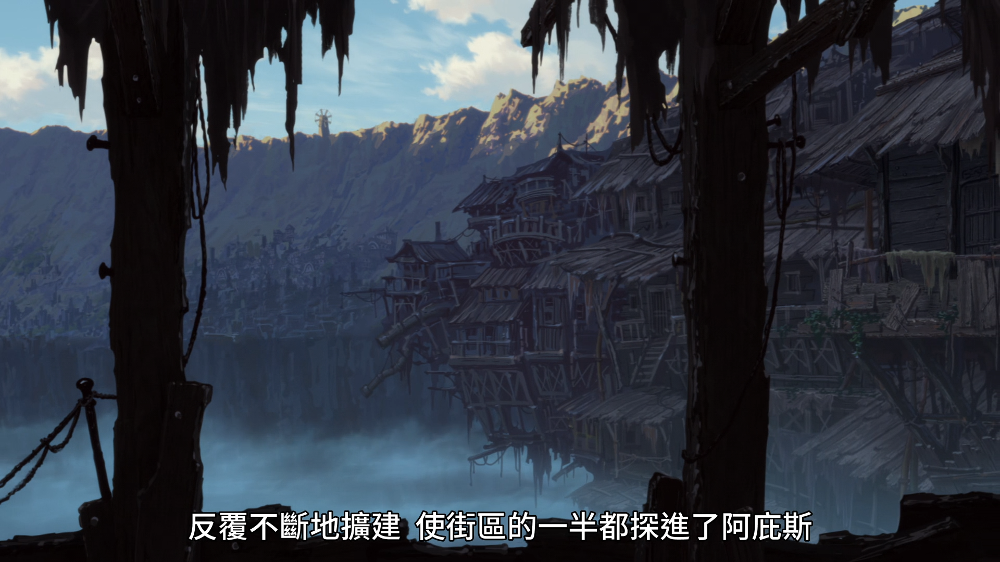

# 深界一层 阿比斯之口
0 - 1350米

深渊诅咒为：头晕和恶心

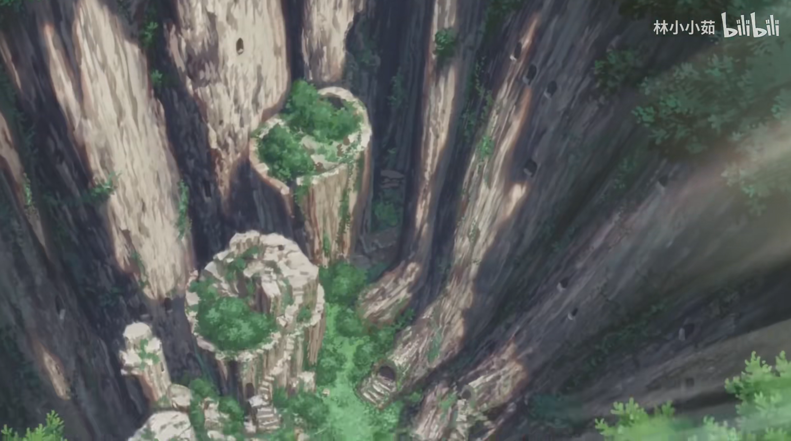

大吊篮

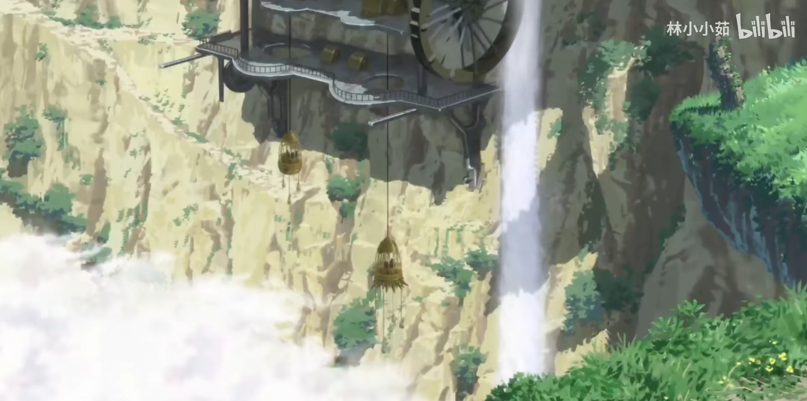

埋葬塔：内部有数百具祈祷骸骨

生物：

- 毒针线蛛

- 锤嘴鸟
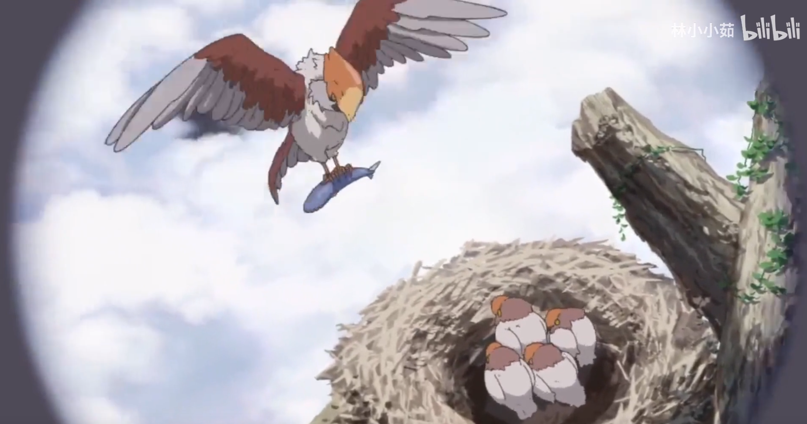

# 深界二层 诱惑森林
1350 - 2600米

深渊诅咒为：重度恶心，头痛和四肢麻痹

天雾树森林

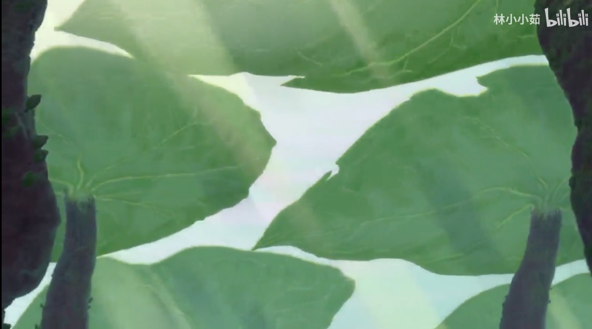

颠倒森林

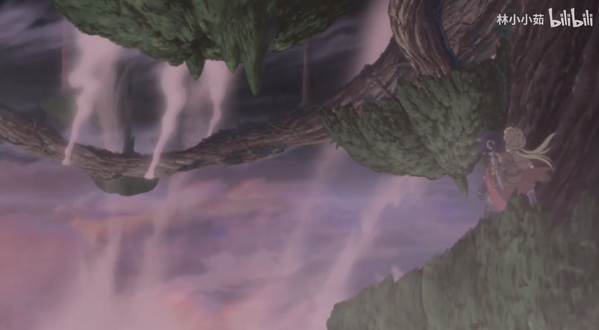

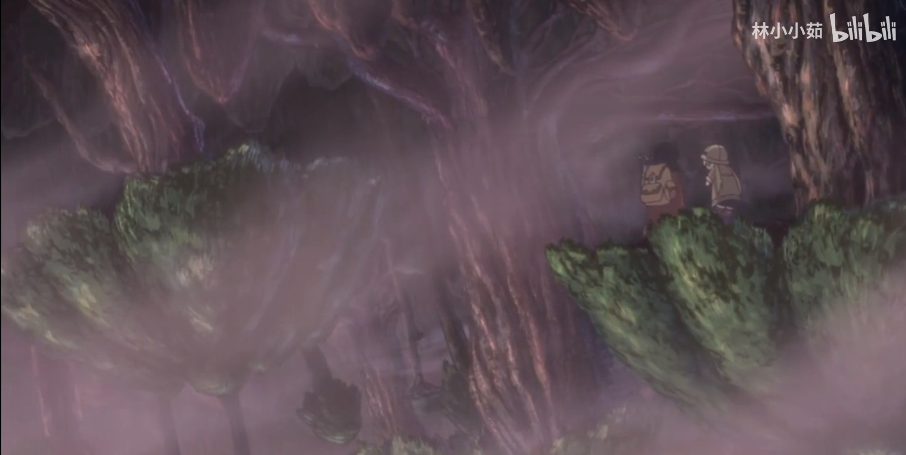

监视基地

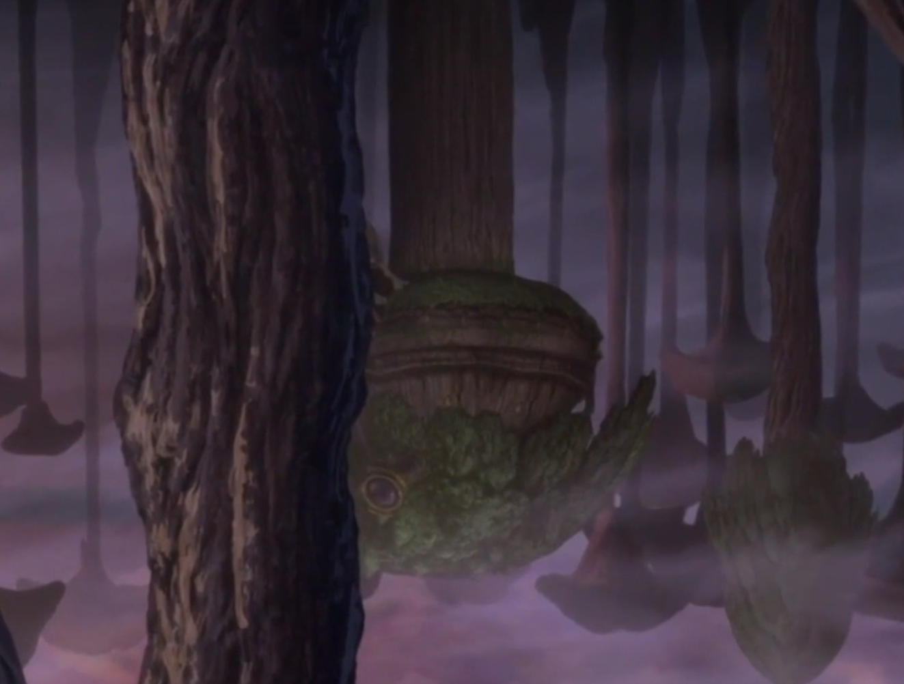

生物：

- 捕风猴

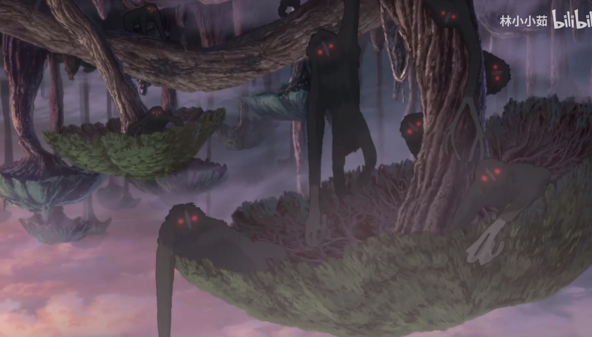

- 驱河马

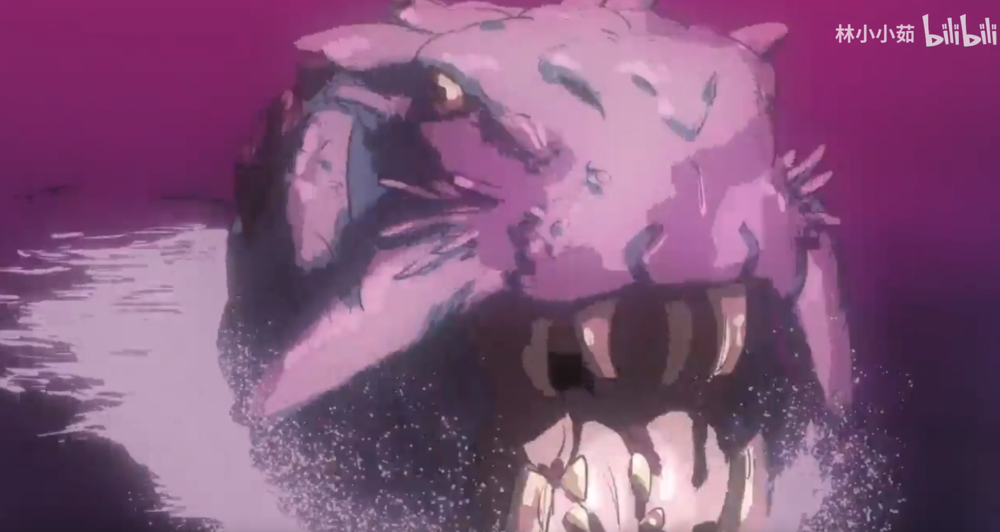

# 深界三层 大断层
2600 - 7000米

深渊诅咒为：重度恶心，头痛和四肢麻痹，加上平衡感异常，幻觉和幻听

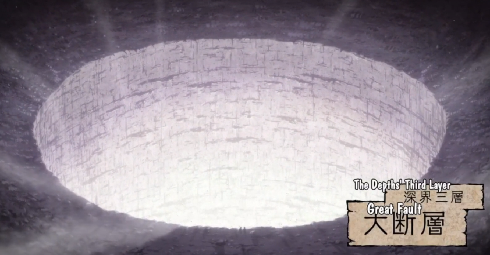

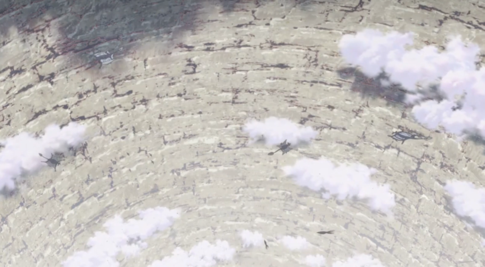

生物：

- 圆翼杰克鸟

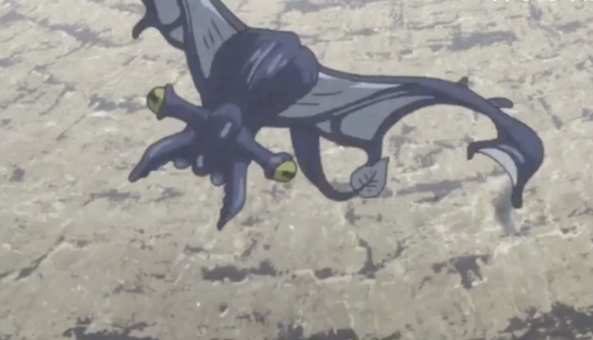

- 泣尸鸟

- 赤蛇

# 深界四层 巨人之杯
7000 -12000米

深渊诅咒为：全身剧痛，七窍流血