# 深渊 Abyss
深度超过2万米

# 巨穴之镇 奥斯小镇

大线桥：探窟家凯旋时使用的线桥，也是热气球的接收地

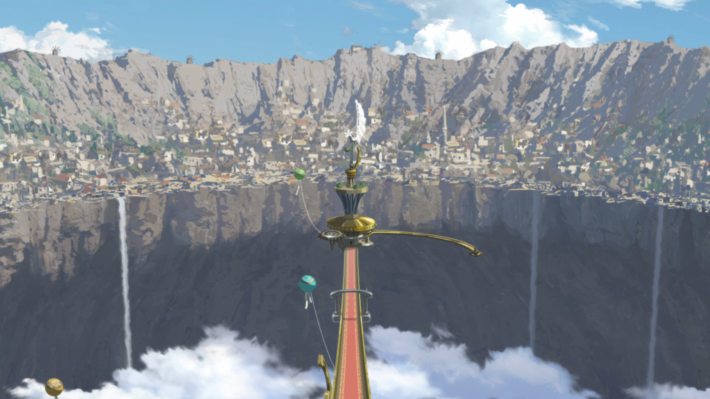

崖壁街：贫民窟

# 深界一层 阿比斯之口
0 - 1350米

深渊诅咒为：头晕和恶心

大吊篮

埋葬塔：内部有数百具祈祷骸骨

生物：

- 毒针线蛛

- 锤嘴鸟

# 深界二层 诱惑森林
1350 - 2600米

深渊诅咒为：重度恶心，头痛和四肢麻痹

天雾树森林

颠倒森林

监视基地

生物：

- 捕风猴

- 驱河马

# 深界三层 大断层
2600 - 7000米

深渊诅咒为：重度恶心，头痛和四肢麻痹，加上平衡感异常，幻觉和幻听

生物：

- 圆翼杰克鸟

- 泣尸鸟

- 赤蛇

# 深界四层 巨人之杯
7000 -12000米

深渊诅咒为：全身剧痛，七窍流血

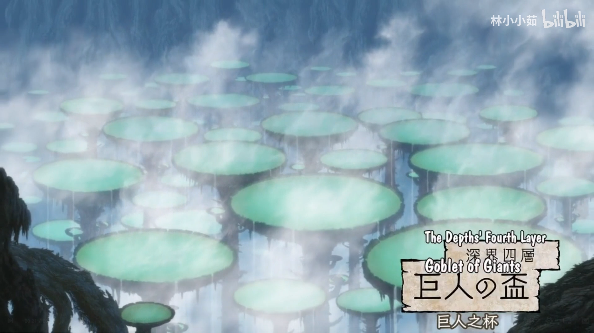

娜娜奇的基地

不屈的花园

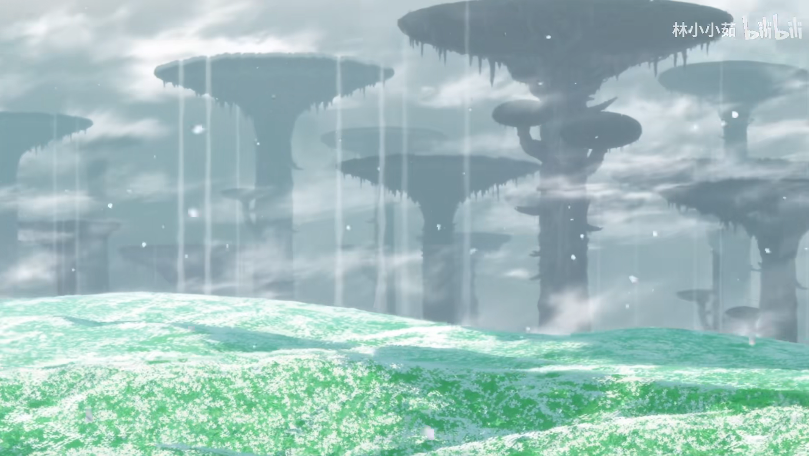

生物：

- 天台蔓

- 穿魂兽

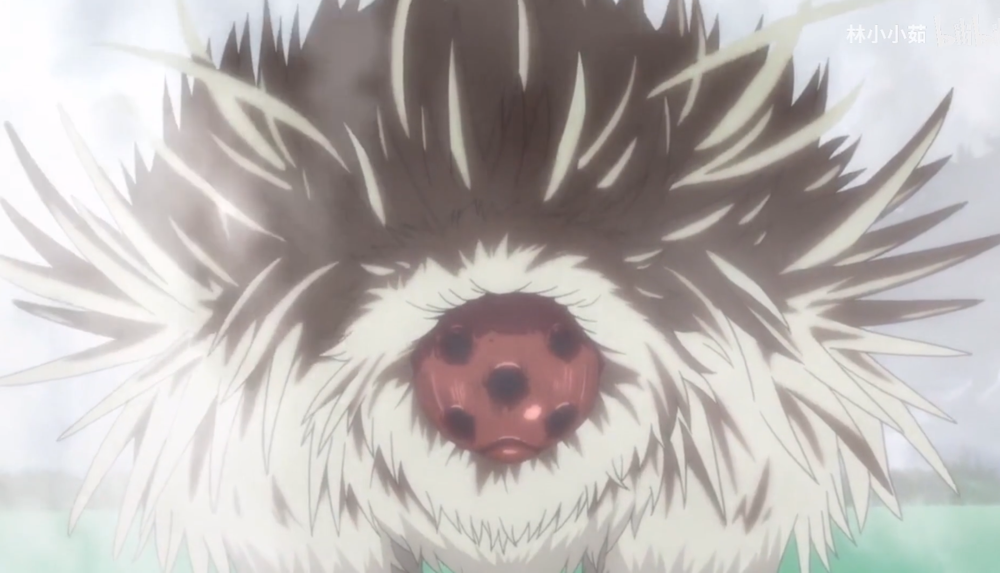

- 语僵虱：伪装成不屈之花

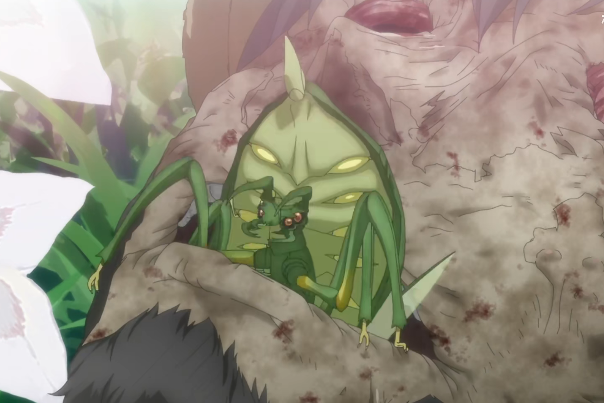

# 深界五层 亡骸之海
12000 - 13000米

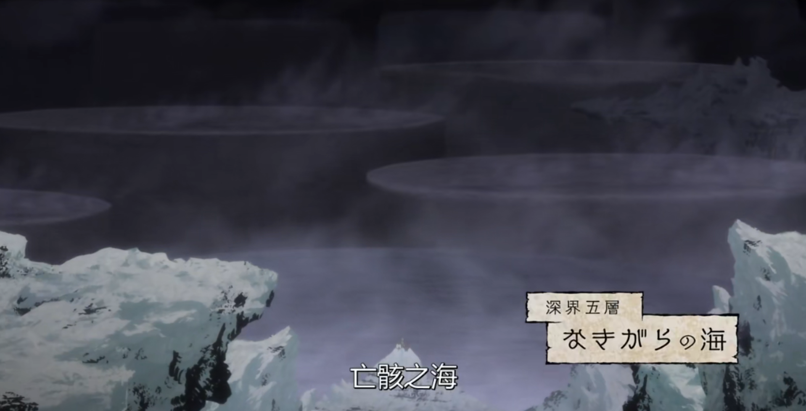

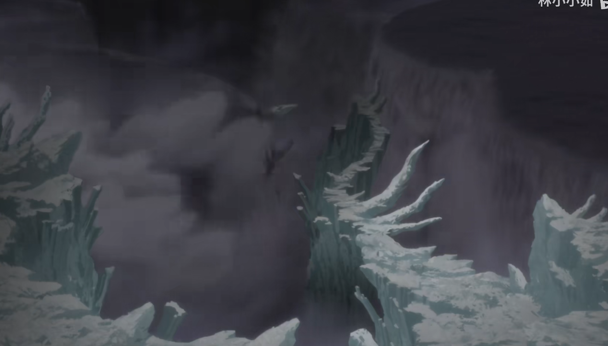

黎明卿的前线基地

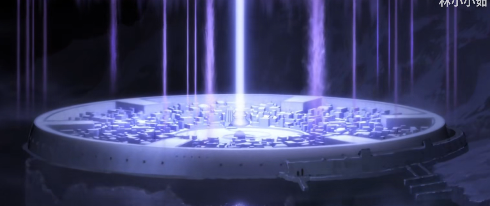

砂岩地带

绝界祭坛

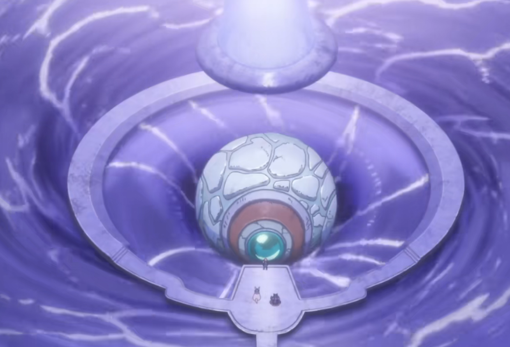

生物：

- 七尾巨头蝎

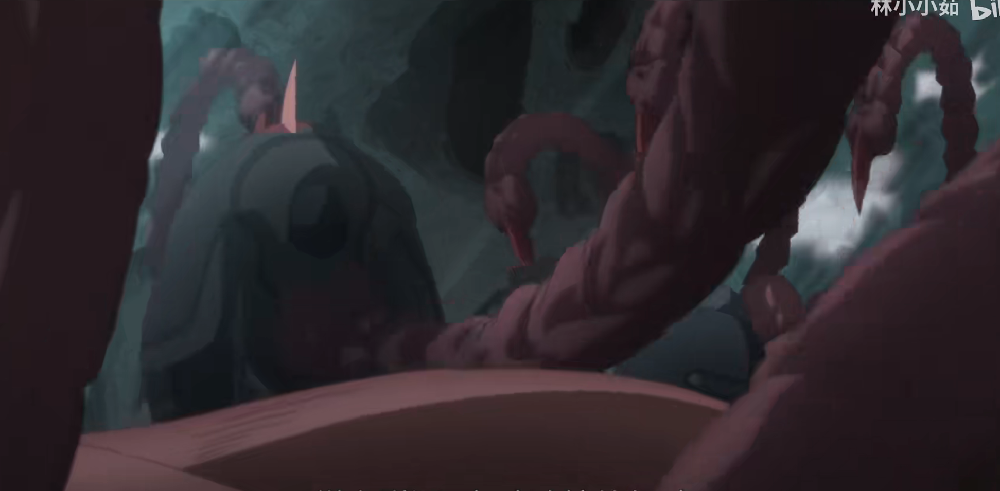

# 深界六层 来无回之都
13000 - 15500米

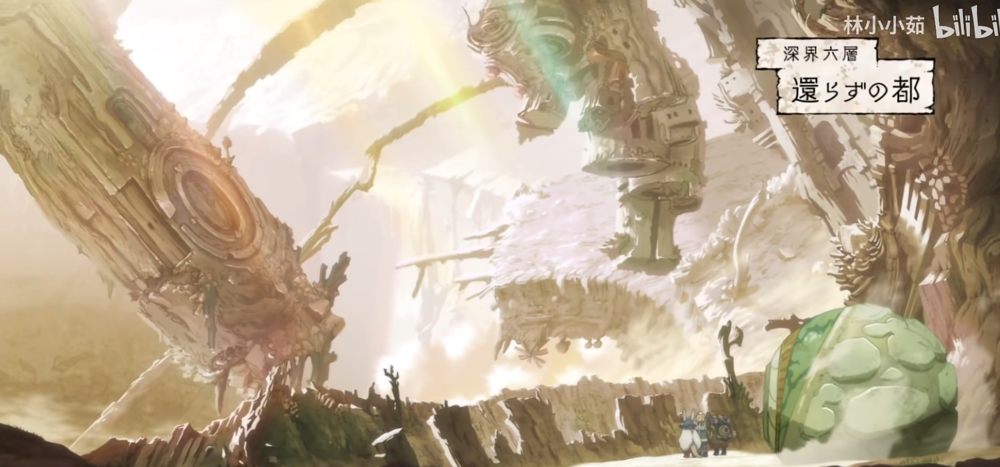

生骸村 伊鲁缪伊

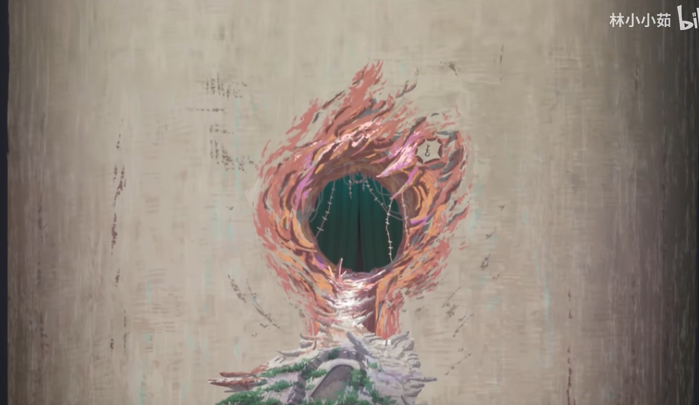

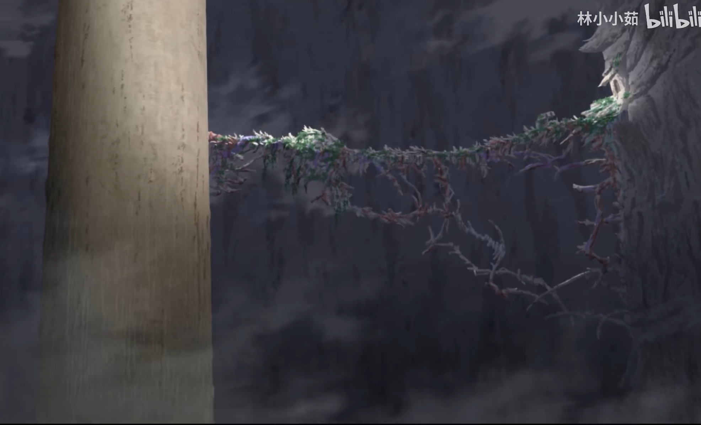