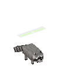

## 花飘飘

可以通过振动巨大的花瓣在空中漂浮

喜欢每一种花

遇到危险会向敌人发射花粉球。这些花粉球可以锁定敌人

花儿可以用来治疗花飘飘

## 浣熊

小型的哺乳动物，栖息于平原

在光线昏暗处眼睛会变成白色并发光

常偷取箱子里的食物，可以食用大部分食物

会用爪子抓挠敌人

## 海鸥

栖息于沙滩

常偷抢人手中的物品

也能帮助冒险家寻找宝藏

## 袋獾

黑白相间的皮毛和奇怪的叫声

成群结队的狩猎鸡和兔子

可以抵御来自几乎所有生物的袭击

可以发出奇怪的吼叫来驱赶周围的敌人

## 林鸱

栖息于黑森林

白天一般都会留在它们的栖息地里面睡觉，到了晚上则会逐渐变得活跃起来

会伪装成树的一部分

捕食蛆

眼睛里的瞳孔会随着周围环境的亮度而发生变化，越暗则越大

驯服后的林鸱可以盘踞在人的手臂上，警惕周围的危险

## 蜜袋鼬

栖息于森林

可以滑翔

喜爱甜的食物，喜欢在树叶间收集树枝

## 臭鼬

能释放一种有毒的屁

人们将臭鼬的屁收集起来，制作成伤害性药水